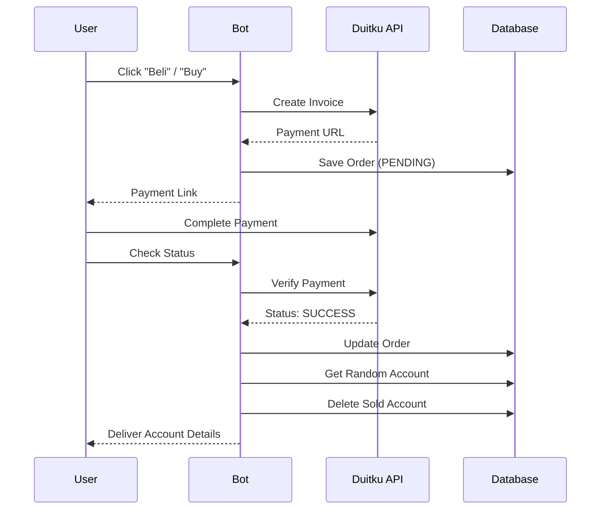

<p align="center">
  
  
  
  
  
</p>

# 🛒 Order-Akun-TeleBot

> A powerful Telegram bot for digital account sales with integrated **Duitku Payment Gateway**, **password encryption**, **automated delivery**, and full **inline/reply keyboard** navigation.

---

## ✨ Features

| Feature                      | Description                                                   |
| ---------------------------- | ------------------------------------------------------------- |
| 🔐 **Role-Based Access**     | Owner and whitelisted admins can manage inventory and pricing |
| � **Duitku Payment Gateway** | Real-time QRIS/VA payment with automatic status checking      |
| 🔒 **Password Encryption**   | Secure credentials with Fernet symmetric encryption           |
| � **Inventory Management**   | Single or bulk CSV import with auto-pricing                   |
| 🚀 **Dual Navigation**       | Both Inline Keyboard and Reply Keyboard menus                 |
| 🛍️ **Automated Delivery**    | Instant account delivery after payment confirmation           |
| 📊 **Stock Tracking**        | Real-time stock grouped by category                           |
| �️ **Modular Architecture**   | Auto-loading command and callback handlers                    |

---

## 📋 Table of Contents

- [Prerequisites](#-prerequisites)
- [Installation](#-installation)
- [Configuration](#-configuration)
- [Commands](#-commands)
- [User Flow](#-user-flow)
- [Project Structure](#-project-structure)
- [Database Schema](#-database-schema)
- [Payment Integration](#-payment-integration)
- [Security](#-security)
- [Troubleshooting](#-troubleshooting)
- [Contributing](#-contributing)
- [License](#-license)

---

## 🔧 Prerequisites

- **Python** 3.8 or higher
- **Telegram Bot Token** from [@BotFather](https://t.me/BotFather)
- **Duitku Merchant Account** (for payment processing)
- Required Python packages:
  - `python-telegram-bot`
  - `python-dotenv`
  - `cryptography`
  - `requests`

---

## 📥 Installation

### 1. Clone the Repository

```bash
git clone https://github.com/yourusername/Order-Akun-TeleBot.git
cd Order-Akun-TeleBot
```

### 2. Create Virtual Environment

```bash
# Windows
python -m venv venv
venv\Scripts\activate

# Linux/macOS
python3 -m venv venv
source venv/bin/activate
```

### 3. Install Dependencies

```bash
pip install python-telegram-bot python-dotenv cryptography requests
```

### 4. Generate Encryption Key

```bash
python -c "from cryptography.fernet import Fernet; print(Fernet.generate_key().decode())"
```

Copy the output for your `ENCRYPTION_KEY` in `.env`.

### 5. Configure Environment

```bash
cp .env.example .env
```

Edit `.env` with your credentials.

### 6. Run the Bot

```bash
python bot.py
```

---

## ⚙️ Configuration

Create a `.env` file with the following variables:

```env
# Telegram Bot
TELEGRAM_TOKEN=your_bot_token_here
OWNER_ID=your_telegram_user_id
ALLOWED_USERS=user_id_1,user_id_2
BANNER_FILE_ID=your_banner_file_id

# Payment Gateway (Duitku)
DUITKU_API_KEY=your_api_key
DUITKU_MERCHANT_CODE=your_merchant_code
DUITKU_ENV=sandbox  # or 'production'

# Security
ENCRYPTION_KEY=your_fernet_key_here
```

### Environment Variables Reference

| Variable               | Required | Description                                  |
| ---------------------- | :------: | -------------------------------------------- |
| `TELEGRAM_TOKEN`       |    ✅    | Bot API token from BotFather                 |
| `OWNER_ID`             |    ✅    | Owner's Telegram user ID                     |
| `ALLOWED_USERS`        |    ❌    | Comma-separated admin IDs                    |
| `BANNER_FILE_ID`       |    ❌    | Telegram file ID for welcome banner          |
| `DUITKU_API_KEY`       |    ✅    | Duitku API key                               |
| `DUITKU_MERCHANT_CODE` |    ✅    | Duitku merchant code                         |
| `DUITKU_ENV`           |    ❌    | `sandbox` or `production` (default: sandbox) |
| `ENCRYPTION_KEY`       |    ✅    | Fernet encryption key for passwords          |

---

## 📝 Commands

### Public Commands

| Command     | Description                    |
| ----------- | ------------------------------ |
| `/start`    | Welcome message with main menu |
| `/help`     | Show available commands        |
| `/accounts` | View current stock by category |

### Admin Commands (Owner & Allowed Users)

| Command     | Description               |
| ----------- | ------------------------- |
| `/restock`  | Add accounts to inventory |
| `/setprice` | Set product pricing       |

---

### Command Details

#### `/restock` _(Admin Only)_

**Single Account:**

```
/restock <email> <username> <password> <category> [price] [description]
```

**Example:**

```
/restock user@email.com netflix_acc pass123 Netflix 50000 Premium 1 Bulan
```

**Bulk Import via CSV:**

1. Create CSV with headers: `email,username,password,category,price,description`
2. Send file with caption `/restock`

**CSV Example:**

```csv
email,username,password,category,price,description
user1@mail.com,account1,pass1,Netflix,50000,Premium 1 Bulan
user2@mail.com,account2,pass2,Spotify,25000,Family Plan
```

---

#### `/setprice` _(Admin Only)_

```
/setprice <product_name> <price> [description]
```

**Example:**

```
/setprice netflix 50000 Akun Premium 1 Bulan Full Garansi
```

---

## 🔄 User Flow

### Purchase Flow via Reply Keyboard

```
/start → 🏷️ Daftar Produk → Select Category → 🛒 Beli → Pay via Duitku → 🔄 Cek Status → ✅ Account Delivered
```

### Purchase Flow via Inline Keyboard

```
/start → 🏷️ Daftar Produk → Beli [Category] → Detail → Buy → 🔗 Pay Now → 🔄 Check Status → ✅ Account Delivered
```

### Menu Structure (Reply Keyboard)

```
┌─────────────────┬───────────────┐
│ 🏷️ Daftar Produk │ 📦 Cek Stok    │
├─────────────────┼───────────────┤
│ 💰 Isi Saldo     │ 👤 Akun Saya   │
├─────────────────┼───────────────┤
│ ❓ Bantuan       │ 🎟️ Voucher     │
└─────────────────┴───────────────┘
```

---

## 📁 Project Structure

```
Order-Akun-TeleBot/
│
├── 📄 bot.py                    # Main entry point
├── 📄 config.py                 # Environment loader
├── 📄 db.py                     # Database with encryption
├── 📄 duitku_api.py             # Duitku payment integration
├── 📄 migrate_encryption.py     # Migration tool for encryption
│
├── 📁 commands/                 # Command handlers (auto-loaded)
│   ├── start.py                 # /start with dual keyboard
│   ├── help.py                  # /help command
│   ├── accounts.py              # /accounts stock viewer
│   ├── restock.py               # /restock with CSV & pricing
│   ├── setprice.py              # /setprice configuration
│   └── text_handler.py          # Reply Keyboard message handler
│
├── 📁 callbacks/                # Inline button handlers (auto-loaded)
│   ├── list_produk.py           # Browse categories
│   ├── detail_produk.py         # Product details
│   ├── buy_produk.py            # Create Duitku invoice
│   ├── check_payment.py         # Verify payment & deliver
│   ├── menu_handler.py          # Handle menu buttons
│   ├── how_to_order.py          # Order instructions
│   └── back_to_start.py         # Navigation
│
├── 📄 .env                      # Environment variables
├── 📄 .env.example              # Environment template
├── 📄 accounts.db               # SQLite database
└── 📄 README.md                 # Documentation
```

---

## 🗄️ Database Schema

### Tables

#### `accounts` - Inventory

| Column     | Type    | Description        |
| ---------- | ------- | ------------------ |
| `id`       | INTEGER | Primary key        |
| `email`    | TEXT    | Account email      |
| `username` | TEXT    | Account username   |
| `password` | TEXT    | Encrypted password |
| `category` | TEXT    | Product category   |

#### `categories` - Product Pricing

| Column        | Type    | Description         |
| ------------- | ------- | ------------------- |
| `name`        | TEXT    | Category name (PK)  |
| `price`       | INTEGER | Price in IDR        |
| `description` | TEXT    | Product description |

#### `orders` - Transactions

| Column         | Type    | Description                     |
| -------------- | ------- | ------------------------------- |
| `order_id`     | TEXT    | Invoice ID (e.g., `INV-ABC123`) |
| `user_id`      | INTEGER | Telegram user ID                |
| `product_name` | TEXT    | Category purchased              |
| `amount`       | INTEGER | Price amount                    |
| `status`       | TEXT    | `PENDING` / `SUCCESS`           |
| `created_at`   | INTEGER | Unix timestamp                  |
| `payment_url`  | TEXT    | Duitku payment URL              |
| `payment_ref`  | TEXT    | Duitku reference ID             |

---

## 💳 Payment Integration

### Duitku API

The bot integrates with **Duitku Payment Gateway** for seamless payments:

1. **Create Invoice** (`/v2/inquiry`)
   - Generates payment link with QRIS/VA options
   - 60-minute expiry period

2. **Check Status** (`/transactionStatus`)
   - Verifies payment completion
   - Auto-delivers account on success

### Flow Diagram



### Environment Modes

| Mode       | Base URL                                          |
| ---------- | ------------------------------------------------- |
| Sandbox    | `https://sandbox.duitku.com/webapi/api/merchant`  |
| Production | `https://passport.duitku.com/webapi/api/merchant` |

---

## 🔒 Security

### Password Encryption

All account passwords are encrypted using **Fernet** symmetric encryption:

```python
from cryptography.fernet import Fernet

# Generate key (do once, save in .env)
key = Fernet.generate_key()

# Encrypt
cipher = Fernet(key)
encrypted = cipher.encrypt(password.encode()).decode()

# Decrypt
decrypted = cipher.decrypt(encrypted.encode()).decode()
```

### Migration Tool

If you have existing unencrypted data:

```bash
python migrate_encryption.py
```

### Best Practices

- ✅ Never commit `.env` to version control
- ✅ Use unique `ENCRYPTION_KEY` per deployment
- ✅ Validate admin permissions before sensitive operations
- ✅ Use `DUITKU_ENV=sandbox` for testing

---

## 🔍 Troubleshooting

<details>
<summary><b>Bot not responding</b></summary>

1. Verify `TELEGRAM_TOKEN` is correct
2. Check if bot is running: `python bot.py`
3. Ensure internet connectivity
</details>

<details>
<summary><b>Payment link not generating</b></summary>

1. Check `DUITKU_API_KEY` and `DUITKU_MERCHANT_CODE`
2. Verify `DUITKU_ENV` setting (sandbox/production)
3. Check Duitku dashboard for API errors
</details>

<details>
<summary><b>Encryption errors</b></summary>

1. Verify `ENCRYPTION_KEY` is valid Fernet key
2. Run `python migrate_encryption.py` for existing data
3. Generate new key if needed
</details>

<details>
<summary><b>CSV import failing</b></summary>

1. Required headers: `email,username,password,category`
2. Optional headers: `price,description`
3. Use UTF-8 encoding
</details>

---

## 🤝 Contributing

### Adding New Commands

1. Create `commands/mycommand.py`:

```python
from telegram import Update
from telegram.ext import ContextTypes

DESCRIPTION = "My command description"

async def mycommand_command(update: Update, context: ContextTypes.DEFAULT_TYPE):
    await update.message.reply_text("Hello!")
```

2. Restart bot - auto-loads!

### Adding New Callbacks

1. Create `callbacks/my_callback.py`:

```python
PATTERN = "^my_pattern$"

async def callback_handler(update, context):
    query = update.callback_query
    await query.answer()
    await query.edit_message_caption(caption="Response")
```

---

## 📄 License

This project is licensed under the MIT License.

---

<p align="center">
  <b>Made with ❤️ for the Telegram community</b>
</p>

<p align="center">
  <a href="https://github.com/yourusername/Order-Akun-TeleBot/issues">Report Bug</a> •
  <a href="https://github.com/yourusername/Order-Akun-TeleBot/issues">Request Feature</a>
</p>
