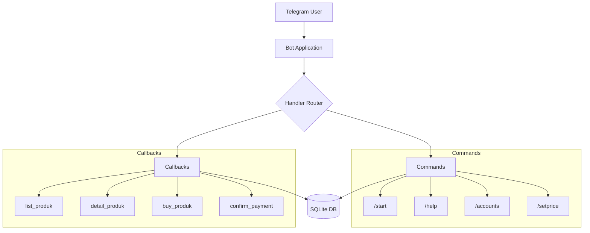

<p align="center">
  
  
  
  
</p>

# 🛒 Order-Akun-TeleBot

> A powerful and modular Telegram bot for managing digital account sales with automated inventory management, order processing, and role-based access control.

---

## ✨ Features

| Feature                     | Description                                                 |
| --------------------------- | ----------------------------------------------------------- |
| 🔐 **Role-Based Access**    | Owner and whitelisted users can manage inventory and prices |
| 📦 **Inventory Management** | Add accounts individually or bulk import via CSV            |
| 💰 **Dynamic Pricing**      | Set custom prices and descriptions per product category     |
| 🛍️ **Order System**         | Automated order creation with unique invoice IDs            |
| 📊 **Stock Tracking**       | Real-time stock monitoring grouped by category              |
| 🎨 **Interactive UI**       | Beautiful inline keyboard menus for seamless navigation     |
| 🔄 **Modular Architecture** | Auto-loading command and callback handlers                  |

---

## 📋 Table of Contents

- [Prerequisites](#-prerequisites)
- [Installation](#-installation)
- [Configuration](#-configuration)
- [Commands](#-commands)
- [Project Structure](#-project-structure)
- [Database Schema](#-database-schema)
- [How It Works](#-how-it-works)
- [API Reference](#-api-reference)
- [Security](#-security)
- [Troubleshooting](#-troubleshooting)
- [Contributing](#-contributing)
- [License](#-license)

---

## 🔧 Prerequisites

- **Python** 3.8 or higher
- **Telegram Bot Token** from [@BotFather](https://t.me/BotFather)
- Required Python packages:
  - `python-telegram-bot`
  - `python-dotenv`

---

## 📥 Installation

### 1. Clone the Repository

```bash
git clone https://github.com/yourusername/Order-Akun-TeleBot.git
cd Order-Akun-TeleBot
```

### 2. Create Virtual Environment (Recommended)

```bash
# Windows
python -m venv venv
venv\Scripts\activate

# Linux/macOS
python3 -m venv venv
source venv/bin/activate
```

### 3. Install Dependencies

```bash
pip install python-telegram-bot python-dotenv
```

### 4. Configure Environment Variables

```bash
cp .env.example .env
```

Edit `.env` with your credentials (see [Configuration](#-configuration)).

### 5. Run the Bot

```bash
python bot.py
```

---

## ⚙️ Configuration

Create a `.env` file in the project root with the following variables:

```env
TELEGRAM_TOKEN=your_bot_token_here
OWNER_ID=your_telegram_user_id
ALLOWED_USERS=user_id_1,user_id_2,user_id_3
BANNER_FILE_ID=your_banner_file_id_here
```

### Environment Variables Reference

| Variable         | Required | Description                         | Example             |
| ---------------- | -------- | ----------------------------------- | ------------------- |
| `TELEGRAM_TOKEN` | ✅       | Bot API token from BotFather        | `123456:ABC-DEF...` |
| `OWNER_ID`       | ✅       | Owner's Telegram user ID            | `123456789`         |
| `ALLOWED_USERS`  | ❌       | Comma-separated admin user IDs      | `111111,222222`     |
| `BANNER_FILE_ID` | ❌       | Telegram file ID for welcome banner | `AgACAgIAAxk...`    |

> 💡 **Tip**: Get your Telegram user ID by messaging [@userinfobot](https://t.me/userinfobot)

---

## 📝 Commands

### Public Commands

| Command     | Description                                          |
| ----------- | ---------------------------------------------------- |
| `/start`    | Display welcome message with user info and bot stats |
| `/help`     | Show available commands based on user permissions    |
| `/accounts` | View current stock grouped by category               |

### Admin Commands (Owner & Allowed Users)

| Command     | Description                                |
| ----------- | ------------------------------------------ |
| `/restock`  | Add accounts to inventory                  |
| `/setprice` | Configure product pricing and descriptions |

---

### Command Details

#### `/start`

Displays a personalized welcome message with:

- User information (ID, username)
- Bot statistics (total stock, transactions)
- Quick access buttons for browsing products

---

#### `/restock` _(Admin Only)_

**Method 1: Single Account**

```
/restock <email> <username> <password> <category>
```

**Example:**

```
/restock user@email.com netflix_user pass123 Netflix
```

**Method 2: Bulk Import via CSV**

1. Prepare a CSV file with headers: `email,username,password,category`
2. Send the file with caption `/restock`

**CSV Format:**

```csv
email,username,password,category
user1@mail.com,account1,pass1,Netflix
user2@mail.com,account2,pass2,Spotify
```

---

#### `/setprice` _(Admin Only)_

Set product pricing and description:

```
/setprice <product_name> <price> <description>
```

**Example:**

```
/setprice netflix 50000 Akun Premium 1 Bulan Full Garansi
```

---

## 📁 Project Structure

```
Order-Akun-TeleBot/
│
├── 📄 bot.py                 # Main application entry point
├── 📄 config.py              # Configuration & environment loader
├── 📄 db.py                  # Database operations module
│
├── 📁 commands/              # Command handlers (auto-loaded)
│   ├── __init__.py
│   ├── start.py              # /start - Welcome message
│   ├── help.py               # /help - Command list
│   ├── accounts.py           # /accounts - Stock viewer
│   ├── restock.py            # /restock - Inventory management
│   └── setprice.py           # /setprice - Price configuration
│
├── 📁 callbacks/             # Inline button handlers (auto-loaded)
│   ├── list_produk.py        # Browse product categories
│   ├── detail_produk.py      # View product details
│   ├── buy_produk.py         # Purchase initiation
│   ├── confirm_payment.py    # Payment confirmation
│   ├── how_to_order.py       # Order instructions
│   └── back_to_start.py      # Navigation back to start
│
├── 📄 .env                   # Environment variables (git-ignored)
├── 📄 .env.example           # Environment template
├── 📄 .gitignore             # Git ignore rules
├── 📄 accounts.db            # SQLite database (auto-created)
└── 📄 README.md              # Documentation
```

---

## 🗄️ Database Schema

The bot uses SQLite with automatic table creation on startup.

### Tables

#### `accounts` - Inventory Storage

| Column     | Type    | Description                   |
| ---------- | ------- | ----------------------------- |
| `id`       | INTEGER | Primary key (auto-increment)  |
| `email`    | TEXT    | Account email                 |
| `username` | TEXT    | Account username/product name |
| `password` | TEXT    | Account password              |
| `category` | TEXT    | Product category              |

#### `categories` - Product Configuration

| Column        | Type    | Description                 |
| ------------- | ------- | --------------------------- |
| `name`        | TEXT    | Category name (primary key) |
| `price`       | INTEGER | Price in IDR                |
| `description` | TEXT    | Product description         |

#### `orders` - Transaction Records

| Column         | Type    | Description                          |
| -------------- | ------- | ------------------------------------ |
| `order_id`     | TEXT    | Unique order ID (e.g., `INV-ABC123`) |
| `user_id`      | INTEGER | Telegram user ID                     |
| `product_name` | TEXT    | Purchased product category           |
| `amount`       | INTEGER | Order amount                         |
| `status`       | TEXT    | Order status (PENDING/COMPLETED)     |
| `created_at`   | INTEGER | Unix timestamp                       |

---

## ⚡ How It Works

### Architecture Overview



### Key Mechanisms

1. **Auto-Loading Handlers**
   - `bot.py` scans `/commands` and `/callbacks` directories
   - Modules are loaded dynamically based on naming conventions
   - Each module exports `DESCRIPTION` for command registration

2. **Permission System**
   - `RESTOCK_ALLOWED` list combines `OWNER_ID` + `ALLOWED_USERS`
   - Admin commands check user ID before execution
   - `/help` filters commands based on user permissions

3. **Order Flow**

   ```
   Browse Products → Select Category → View Details → Create Order → Confirm Payment
   ```

4. **Inventory Management**
   - Accounts are grouped by `category`
   - Random account selection for sales
   - Automatic deletion after confirmed sale

---

## 📚 API Reference

### Database Functions (`db.py`)

| Function                  | Parameters                              | Returns      | Description                     |
| ------------------------- | --------------------------------------- | ------------ | ------------------------------- |
| `setup_db()`              | -                                       | -            | Initialize database tables      |
| `add_account()`           | email, username, password, category     | -            | Add new account                 |
| `get_all_accounts()`      | -                                       | List[Tuple]  | Get all accounts                |
| `get_unique_categories()` | -                                       | List[Tuple]  | Get categories with stock count |
| `get_random_account()`    | category                                | Tuple / None | Get random account by category  |
| `delete_account()`        | account_id                              | -            | Remove account from inventory   |
| `set_product_price()`     | name, price, description                | -            | Set/update product pricing      |
| `get_product_details()`   | name                                    | Tuple        | Get price and description       |
| `create_order()`          | order_id, user_id, product_name, amount | -            | Create new order                |
| `get_order()`             | order_id                                | Tuple / None | Get order details               |
| `update_order_status()`   | order_id, status                        | -            | Update order status             |

---

## 🔒 Security

### Best Practices

- ✅ Never commit `.env` to version control
- ✅ Use environment variables for all sensitive data
- ✅ Validate user permissions before admin operations
- ✅ Sanitize user inputs using `html.escape()`

### Security Considerations

> ⚠️ **Warning**: Passwords are stored in plain text. For production use, consider:
>
> - Encrypting sensitive data at rest
> - Using secure credential storage
> - Implementing audit logging

---

## 🔍 Troubleshooting

### Common Issues

<details>
<summary><b>Bot not responding to commands</b></summary>

1. Verify `TELEGRAM_TOKEN` is correct
2. Ensure bot is running: `python bot.py`
3. Check internet connectivity
4. Confirm bot was started via BotFather

</details>

<details>
<summary><b>Permission denied for /restock</b></summary>

1. Verify your Telegram user ID
2. Check `OWNER_ID` in `.env`
3. Ensure your ID is in `ALLOWED_USERS` if not owner
4. Restart bot after `.env` changes

</details>

<details>
<summary><b>Database errors</b></summary>

1. Check if `accounts.db` is locked by another process
2. Verify write permissions in project directory
3. Delete `accounts.db` to reset (⚠️ loses all data)

</details>

<details>
<summary><b>CSV import failing</b></summary>

1. Ensure CSV has correct headers: `email,username,password,category`
2. Use UTF-8 encoding
3. Check for empty rows or malformed data

</details>

---

## 🤝 Contributing

Contributions are welcome! Here's how to extend the bot:

### Adding New Commands

1. Create file in `commands/` directory (e.g., `mycommand.py`)
2. Define the command function:

   ```python
   from telegram import Update
   from telegram.ext import ContextTypes

   DESCRIPTION = "My command description"

   async def mycommand_command(update: Update, context: ContextTypes.DEFAULT_TYPE):
       await update.message.reply_text("Hello!")
   ```

3. Restart the bot - command auto-loads!

### Adding New Callbacks

1. Create file in `callbacks/` directory
2. Define `PATTERN` and `callback_handler`:

   ```python
   PATTERN = "^my_pattern$"

   async def callback_handler(update, context):
       query = update.callback_query
       await query.answer()
       # Handle callback
   ```

---

## 📄 License

This project is licensed under the MIT License - see the [LICENSE](LICENSE) file for details.

---

<p align="center">
  <b>Made with ❤️ for the Telegram community</b>
</p>

<p align="center">
  <a href="https://t.me/yourbotusername">Try the Bot</a> •
  <a href="https://github.com/yourusername/Order-Akun-TeleBot/issues">Report Bug</a> •
  <a href="https://github.com/yourusername/Order-Akun-TeleBot/issues">Request Feature</a>
</p>
